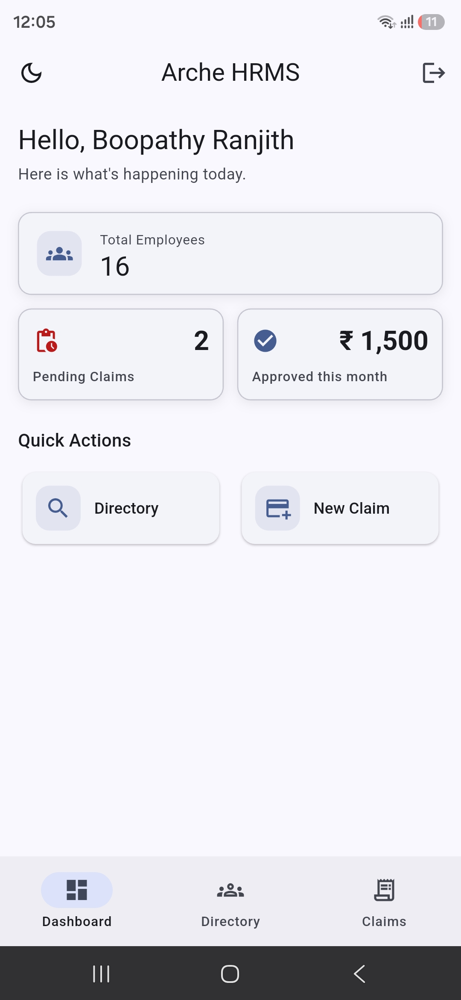
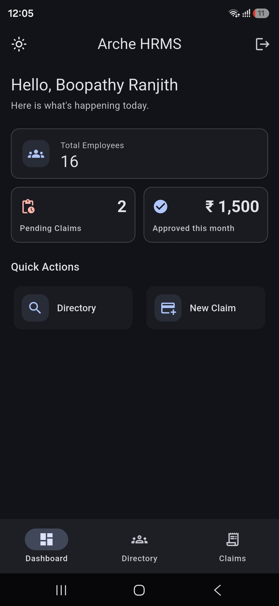
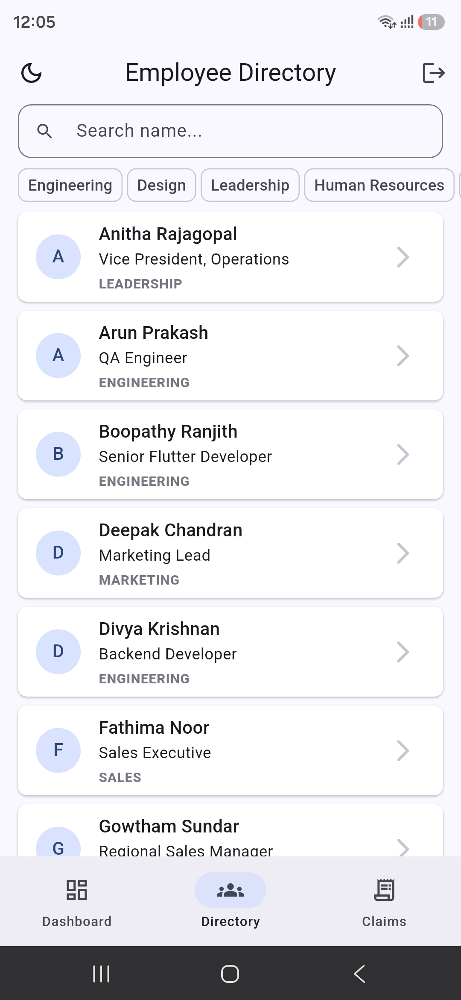
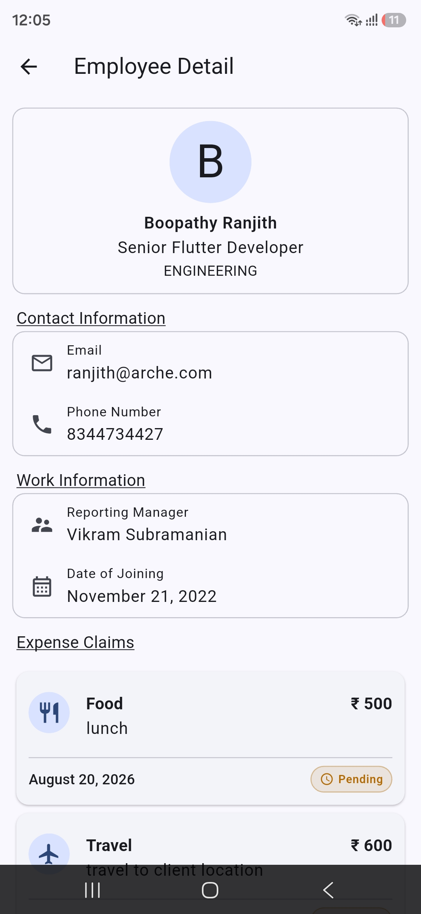
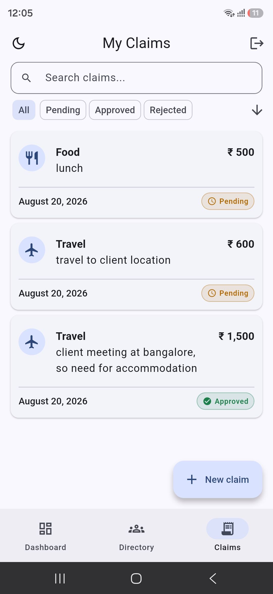
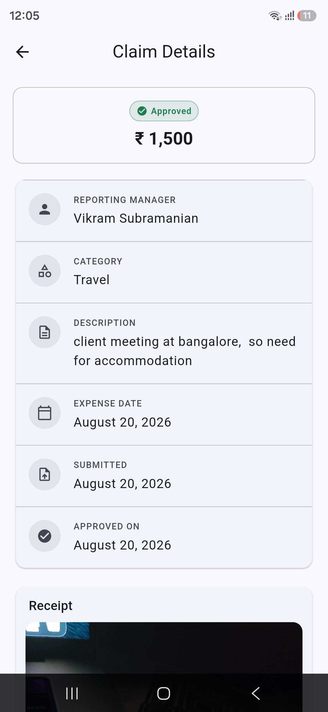
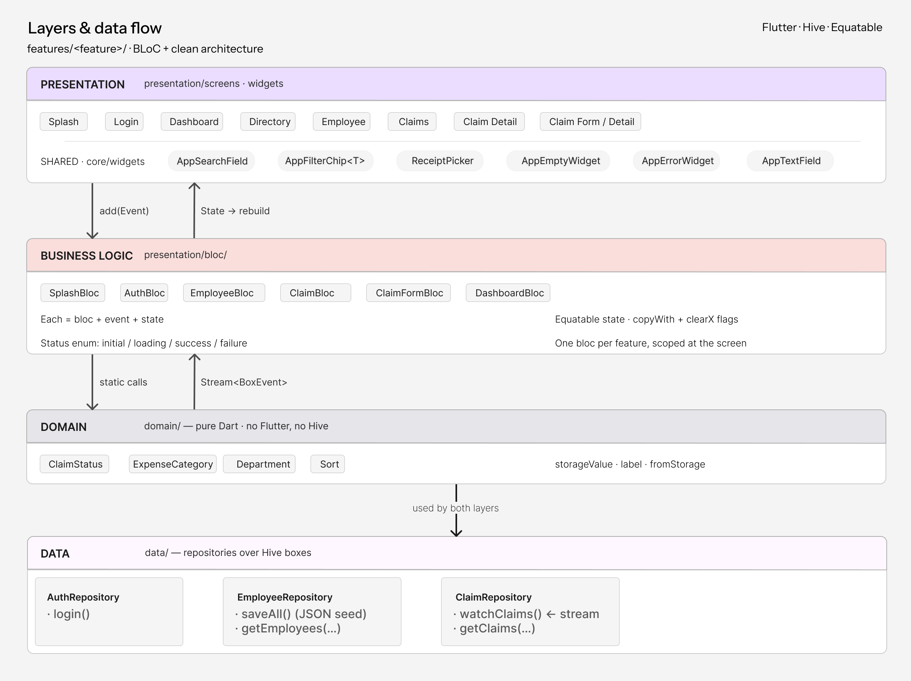

# HRMS-MOD-B — Employee Directory & Expense Claims

A Flutter module for Arche's internal HRMS. Employees look up colleagues in the company directory and submit expense claims for money they spent on company work.

Local data only — no backend, no API layer. The repositories are the seam a real

**Repository:** [https://github.com/GBRanjith/hrms_mod_b](https://github.com/GBRanjith/hrms_mod_b.git)

## Getting Started

The Flutter version is pinned with FVM (`.fvmrc` → 3.44.9), so prefix commands
with `fvm`. Without it a different global Flutter may be used and you'll get
version errors that look like code errors.

Android 7.0 (API 24) is the minimum; iOS 13.0 for the iOS build.

```bash
fvm install                        # first time only
fvm flutter pub get
fvm dart run build_runner build    # generates the Hive adapters
```
### Run it
```bash
fvm flutter run
```

Or pick a device explicitly:
```bash
fvm flutter devices
fvm flutter run -d <device-id>
```
### Log in
There's one dummy account, checked against constants — no auth backend:
```
Employee ID   emp001
Password      password123
```

### Build the APK
```bash
fvm flutter build apk --release
# build/app/outputs/flutter-apk/app-release.apk

A prebuilt APK is included in this repo at `release/app-release.apk`.
```

## Screenshots









## System design



------

## Architecture

Feature-first, with the layers inside each feature:

```
lib/
├── main.dart
├── app/                    app wiring — router, initializer
├── core/                   shared: theme, storage, widgets, enums, utils
└── features/
    ├── splash/
    ├── auth/
    ├── employee/
    ├── claim/
    ├── dashboard/
    └── home/
```
Every feature repeats the same three folders:
```
features/claim/
├── data/            models (@HiveType) + repository
├── domain/          enums — the business vocabulary
└── presentation/    bloc + screens + widgets
```

### State management — why Bloc

The spec allowed Provider, Riverpod or Bloc. I picked Bloc because most of what
happens in this module is a *user action on shared data* — submit, search,
filter, sort, approve, reject. Each one becomes an event, so the flow is easy to
follow: an event goes in, a new state comes out, the UI rebuilds.

It also keeps async work in one place. Debounced search and the claim stream
live in the bloc, not scattered across widgets.

Every feature has the same three files — `bloc`, `event`, `state` — and all the
filtering and sorting happens in the bloc or the repository, never in `build()`.

### How the dashboard stays correct

The dashboard shows *pending claims* and *approved this month*. When a claim is approved on the My Claims screen, both numbers have to change together.

I didn't want to store those numbers anywhere — that means two copies of the same truth, and they eventually disagree. I also didn't want one bloc telling another bloc what happened, because then the screens know about each other.

So there's one stream instead:

 - `ClaimRepository.watchClaims()` fires whenever a claim is written
 - `ClaimBloc` and `DashboardBloc` both listen to it
 - the dashboard counts the numbers again from the claim list

Approving a claim writes one record. The stream tells both screens, and both update together. The numbers are counted, never saved — so they can't go out of sync.

---

## Simulating manager approval

In a real HRMS a manager would approve claims from their own screen, with their own login. There are no roles here, so it's a demo shortcut instead:

- **long-press** a claim in My Claims, or
- tap **Change status** on Claim Detail

Both open a sheet to switch between Pending, Approved and Rejected. Rejecting asks for a reason — the employee needs to know what to fix. Approving doesn't.

It's there to show the dashboard reacting to a status change, nothing more.

---
## Tech

Flutter 3.44.9 (FVM-pinned) · Dart 3.12 · flutter_bloc · go_router · hive · shared_preferences · path_provider · image_picker · intl · Material 3